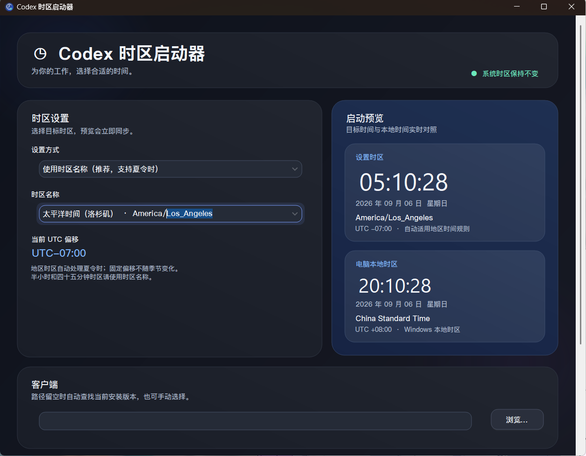

# Codex 时区启动器

一个面向 Windows 的 Codex 桌面客户端时区启动器。它只为本次启动的 Codex 进程设置时区，不修改 Windows 系统时区，也不会影响其他软件。



## 功能

- 使用 IANA 时区名称启动 Codex，自动处理夏令时。
- 支持固定 UTC 偏移模式。
- 实时对照显示目标时区和电脑本地时区。
- 自动查找已安装的 Codex 桌面客户端，也可手动选择程序路径。
- 保存选择并一键启动 Codex。
- 支持创建桌面快捷方式。
- 集成 [Codex Dream Skin](https://github.com/Fei-Away/Codex-Dream-Skin) 的兼容启动与自动应用皮肤流程。
- 跟随 Windows 深色/浅色模式，界面可适应不同窗口尺寸。
- 设置保存在程序同目录的 `data/settings.json`。

## 技术栈

- [Vue 3](https://vuejs.org/) + TypeScript
- [Tauri 2](https://tauri.app/)
- [MacVue](https://github.com/antonreshetov/macvue)
- Rust 命令层
- C# 系统功能后端

## 直接运行

下载或构建 `CodexTimeZoneLauncher.exe` 后直接运行即可。Windows 需要 WebView2 Runtime；Windows 10/11 通常已经预装。

## 开发环境

- Windows 10 或 Windows 11
- Node.js LTS
- pnpm
- Rust stable-msvc
- Visual Studio 2022 Build Tools，包含“使用 C++ 的桌面开发”和 Windows SDK
- WebView2 Runtime
- Windows PowerShell 5.1
- .NET Framework C# 编译器

源码位于 `resource` 目录。安装依赖：

```powershell
cd resource
pnpm install
```

开发运行：

```powershell
.\scripts\dev.ps1
```

正式编译：

```powershell
.\scripts\build.ps1
```

构建完成后，脚本会在仓库根目录生成 `CodexTimeZoneLauncher.exe`。

如果开发工具集中安装在自定义目录，或下载依赖需要代理，可在运行脚本前设置：

```powershell
$env:CODEX_TZ_DEV_ROOT = 'D:\development'
$env:CODEX_TZ_PROXY = 'http://127.0.0.1:7890'
```

这些变量均为可选项，示例路径和端口可按实际环境修改。

## 工作方式

Vue 界面仅调用 Tauri 注册的后端命令。Tauri 将内嵌的 C# 后端释放到程序旁的 `data/.runtime`，由后端负责客户端发现、配置保存、快捷方式以及带 `TZ` 环境变量的进程启动。首次运行时会尝试迁移旧版设置；无法访问旧设置时会安全地使用默认配置。

## 说明

固定 UTC 偏移不会随夏令时变化。需要半小时或四十五分钟偏移的地区时，请选择对应的 IANA 时区名称。

## License

本项目采用 MIT License。
